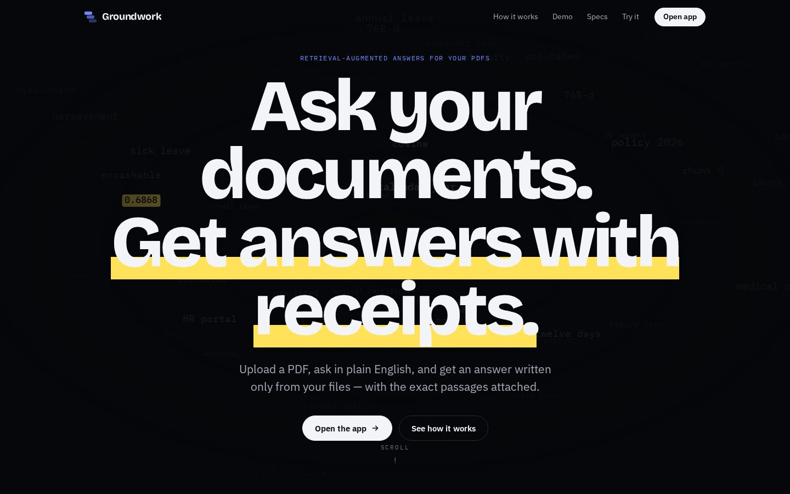
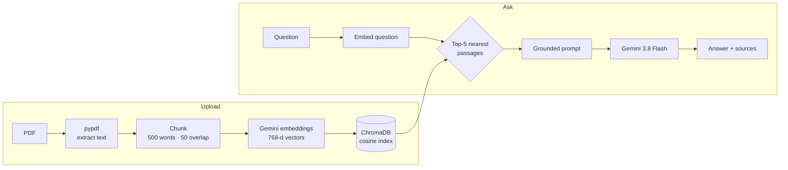
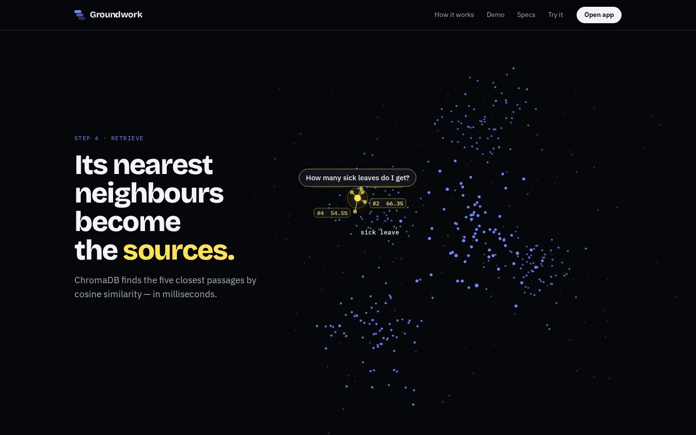
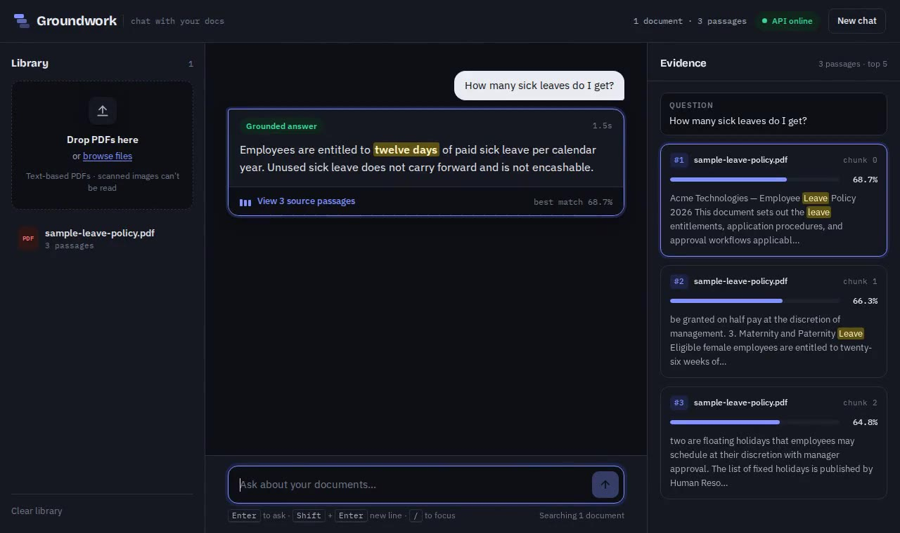

# Groundwork — Chat With Your Documents

[](https://github.com/aryan22514/rag-chatbot/actions/workflows/ci.yml)


A **Retrieval-Augmented Generation (RAG)** app: upload a PDF, Word or text file, ask questions in plain English, and get answers written **only from your documents** — with the exact source passages attached and ranked by match score. If the answer isn't in your files, it says so instead of guessing.



## How it works



| Step | What happens | Why it matters |
|---|---|---|
| **Read** | `pypdf` rebuilds text from every page | PDFs store positioned glyphs, not paragraphs |
| **Chunk** | 500-word passages, 50 words of overlap | A sentence on a boundary is never split in half |
| **Embed** | `gemini-embedding-001`, truncated to 768 dims | `RETRIEVAL_DOCUMENT` / `RETRIEVAL_QUERY` task types for better matching |
| **Retrieve** | ChromaDB HNSW index, cosine similarity | Finds the 5 closest passages in milliseconds |
| **Answer** | Gemini writes from retrieved passages only | A strict system instruction prevents outside knowledge and forces "not found" when unsure |



## Features

- **Grounded answers with receipts**: every answer lists its source passages with match scores and **page numbers** (PDFs)
- **PDF, Word (.docx), .txt and .md** uploads, with duplicate detection by content (not filename) and a configurable size limit
- **Honest refusals**: asks outside your documents get *"I couldn't find that in your documents."*
- **Suggested questions from your own documents**: on upload, Gemini writes questions the PDF actually answers; shown as chips, plus "ask next" follow-ups after each answer drawn from the documents it cited. Once every suggestion has been asked, a new set is written automatically, never repeating earlier ones
- **Scroll-driven landing page** that animates the whole pipeline, plus a live "try it" box wired to the API
- **Chat app** with drag-and-drop upload, evidence panel with keyword highlighting, delete / clear library
- **Built for free-tier limits**: automatic fallback across Gemini models when one is rate limited, an answer cache so repeat questions cost nothing, and a clear 429 with `Retry-After` when every model is out of quota
- **Robust API**: clear errors for scanned or corrupt PDFs, AI-service failures (502), and invalid input (422)
- **Tested & containerised**: 62 pytest tests (Gemini is faked, so tests run offline), Docker image, GitHub Actions CI



## Quick start

```bash
git clone https://github.com/aryan22514/rag-chatbot.git
cd rag-chatbot

python3 -m venv .venv && source .venv/bin/activate
pip install -r requirements-dev.txt

cp .env.example .env          # then add your key from https://aistudio.google.com/apikey
uvicorn app.main:app --reload
```

Open **http://localhost:8000** for the landing page, **/app.html** for the chat app, and **/docs** for interactive Swagger API docs.

### With Docker

```bash
cp .env.example .env          # add your Gemini key
docker compose up --build
```

Or run the published image:

```bash
docker run -p 8000:8000 -e GEMINI_API_KEY=your_key ghcr.io/aryan22514/rag-chatbot:latest
```

Vectors persist in the `chroma-data` volume across restarts.

## Deploy a public demo (free, on Render)

The repo includes a [`render.yaml`](render.yaml) Blueprint that builds the Dockerfile on Render's free plan.

1. Push this repo to GitHub.
2. On [render.com](https://render.com), sign in with GitHub → **New → Blueprint** → pick the repo.
3. Paste your `GEMINI_API_KEY` when asked → **Apply**. The site goes live at `https://groundwork-xxxx.onrender.com` in a few minutes.

With `PUBLIC_MODE=true` (set by the Blueprint), the app is safe to share:

| Protection | Default |
|---|---|
| Each browser gets its own **private library** (anonymous cookie → its own ChromaDB collection) | visitors never see each other's files |
| Files per visitor | 3, up to 5 MB each |
| Questions per IP address per day (repeats from the cache are free) | 25 |
| Uploads per IP address per day | 10 |

Free Render services sleep after 15 minutes idle (the first visit then takes ~30 s) and their disk is wiped on restart, so demo libraries are temporary. Every push to `main` redeploys automatically.

## Free-tier limits

Free Gemini API keys have small daily quotas **per model** (for example 20 requests/day). The app is built around that:

| Situation | What happens |
|---|---|
| Main model (`gemini-3.8-flash`) is rate limited | Retries on `gemini-3.6-flash`, then `gemini-3.5-flash-lite`; the answer shows which model replied |
| You ask a question you've asked before | Answered from an in-memory cache: no API call, works even when out of quota |
| Every model is out of quota | `429` with a `Retry-After` header and a plain-English message in the UI |
| Uploading a document | Suggested questions use the cheapest model first, so uploads don't spend the main model's quota |

Change the order or models in `.env` (see `.env.example`). Your actual limits are shown in [Google AI Studio](https://aistudio.google.com/rate-limit).

## API

| Method | Endpoint | Description |
|---|---|---|
| `POST` | `/api/upload` | Upload a PDF/DOCX/TXT/MD → extract, chunk (with page numbers), embed, store. `409` if the same content is already stored, `413` if over `MAX_UPLOAD_MB` |
| `GET` | `/api/ask?q=…&top_k=5` | Grounded answer + ranked source passages |
| `GET` | `/api/search?q=…` | Raw similarity search (no LLM) |
| `GET` | `/api/suggestions?limit=6` | Questions generated from your documents (cached per document) |
| `POST` | `/api/suggestions/more` | A fresh set of questions that avoids everything already suggested or asked (`{"asked": [...]}`) |
| `GET` | `/api/documents` | List documents in the library |
| `DELETE` | `/api/documents/{id}` | Remove a document and its passages |
| `DELETE` | `/api/reset` | Clear the whole library |
| `GET` | `/api/stats` | Document and passage counts |
| `GET` | `/api/config` | Upload size and, on the public demo, per-visitor limits |
| `GET` | `/api/health` | Health check (used by Docker) |

## Project structure

```
app/
├── main.py                  # FastAPI app, serves the UI
├── config.py                # Typed settings from .env (pydantic-settings)
├── api/routes.py            # HTTP endpoints + error handling
└── core/
    ├── document_processor.py  # PDF → text → overlapping chunks
    ├── embeddings.py          # Gemini embedding client (batched)
    ├── vector_store.py        # ChromaDB: add, search, list, delete, stored questions
    ├── suggestions.py         # Gemini-written questions each document can answer
    ├── rag_chain.py           # Retrieve → build grounded prompt → answer (+ answer cache)
    ├── library.py             # One library locally; a private one per visitor on the demo
    ├── quota.py               # Daily per-IP limits for the public demo
    └── llm.py                 # Gemini calls with model fallback on rate limits
public/
├── index.html               # Scroll-driven landing page
├── app.html                 # Chat app
├── fonts/  media/           # Self-hosted fonts, demo video
tests/
├── test_chunking.py         # Chunking contract: overlap, order, counts
├── test_api.py              # End-to-end API incl. every error path
├── test_suggestions.py      # Question parsing, storage, caching, failure handling
├── test_llm.py              # Rate limits: fallback order, cache, 429 + Retry-After
├── test_formats.py          # Page citations, Word/text uploads, duplicates, size limit
├── test_public.py           # Public demo: private libraries, daily limits
└── conftest.py              # Fake Gemini client for offline tests
.github/workflows/ci.yml     # Lint → test → Docker build → smoke test → publish
```

## CI/CD

Every push and pull request runs **GitHub Actions**:

1. **Lint** with `ruff`
2. **Test** with `pytest` (62 tests, Gemini faked, no API key or cost)
3. **Build** the Docker image and **smoke-test** the running container
4. On `main`: **publish** the image to GitHub Container Registry (`ghcr.io/aryan22514/rag-chatbot`)

## Tech stack

**Backend:** Python, FastAPI, Uvicorn, Pydantic · **AI:** Google Gemini (`gemini-embedding-001`, Gemini 3.8 Flash) · **Vector DB:** ChromaDB · **Documents:** pypdf, python-docx · **Testing:** pytest, ruff · **DevOps:** Docker, Docker Compose, GitHub Actions, GHCR · **Frontend:** HTML, CSS, vanilla JS, Canvas

## License

MIT © Aryan Mehtele
